<p align="center">
  <a href="README.md">English</a> | <a href="README.zh-CN.md">中文</a>
</p>

<h1 align="center">Machine Vision App</h1>

<p align="center">
  
  
  
  
  
  
  
</p>

<p align="center">
  A modern machine vision desktop application for real-time video processing,
  image recognition, barcode scanning and measurement over local or network cameras.
  <br/>
  Built with <strong>WPF</strong> · <strong>OpenCvSharp</strong> · <strong>ZXing.Net</strong> · <strong>.NET 8</strong>
</p>

<p align="center">
  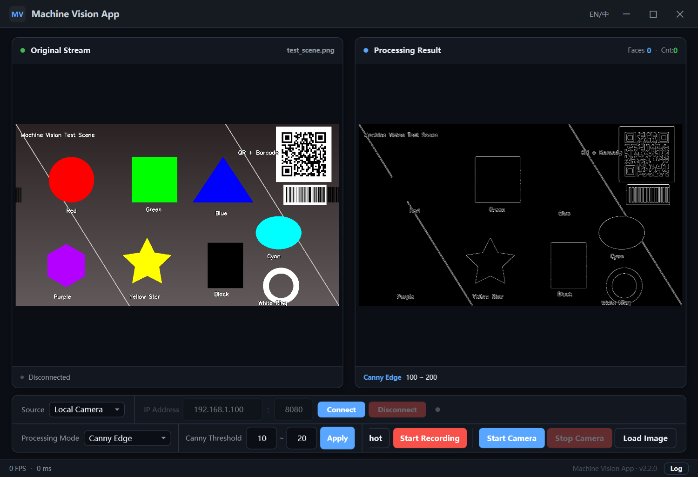
</p>

---

## Features

- **Dual Source** – Local USB camera or network IP camera (RTSP / MJPEG over HTTP)
- **Face Detection** – Haar cascade classifier with configurable overlay style
- **11 Processing Modes** – Canny, Sobel, Laplacian, Binary, Contour, QR/Barcode, Color Detection, Template Matching, Shape Detection, Feature Matching, Enhancement
- **QR / Barcode** – Real-time decoding of QR codes and 1D barcodes (EAN/UPC/Code128/Code39) with on-screen result display
- **Color Detection** – HSV-based detection with 9 preset colors, object counting, and click-to-pick sampling directly from the live image
- **Template Matching** – Locate a template image in the live feed with a match score
- **Shape Detection** – Classify objects into circles, rectangles, triangles, pentagons and polygons with per-type statistics
- **Feature Matching** – ORB keypoint matching with RANSAC homography, robust to rotation and scale changes
- **Enhancement** – CLAHE histogram equalization and unsharp masking for low-contrast scenes
- **Video Recording** – Record processed video to AVI files with one click
- **Screenshot** – Save the current frame as a PNG image
- **Network Camera** – Connect to phone cameras via IP Webcam apps
- **i18n Support** – Built-in English and Chinese, switchable at runtime
- **Modern Dark UI** – GitHub-dark theme, card layout, status bar, collapsible log panel, resizable window
- **Image Analysis** – Load static images and apply the full processing pipeline
- **Real-time Stats** – FPS counter, processing time, face/contour counts

---

## Processing Modes

All screenshots below are produced by the app itself using the bundled test scene `TestImages/test_scene.png`.

<table>
  <tr>
    <td align="center"><b>Canny Edge</b><br/>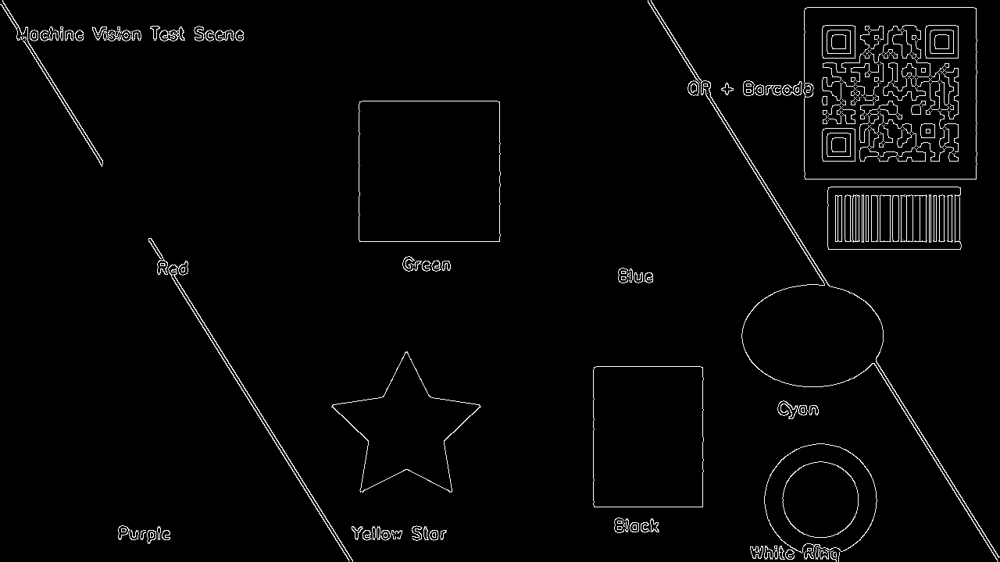</td>
    <td align="center"><b>Contour Detection</b><br/>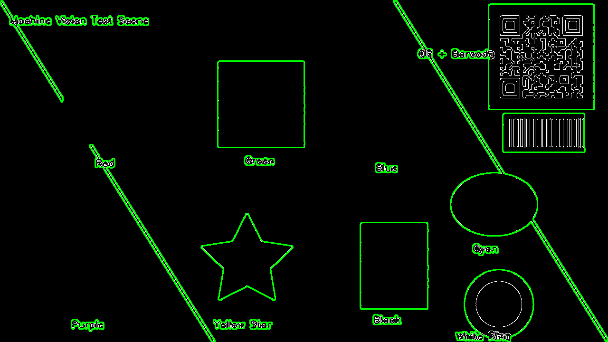</td>
  </tr>
  <tr>
    <td align="center"><b>Binary Threshold</b><br/>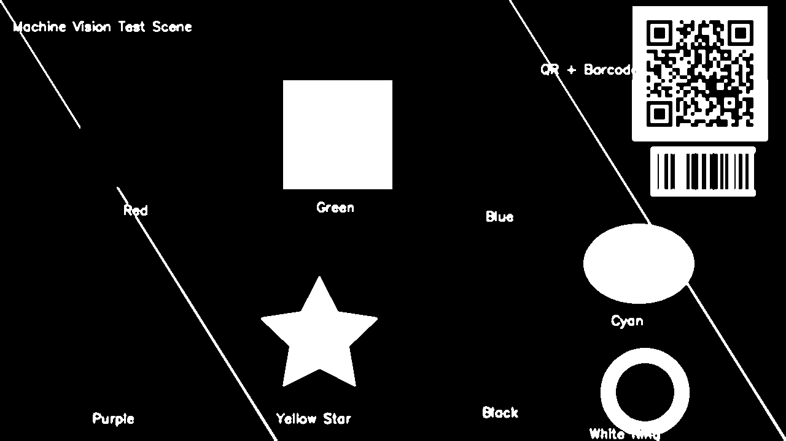</td>
    <td align="center"><b>Shape Detection</b><br/>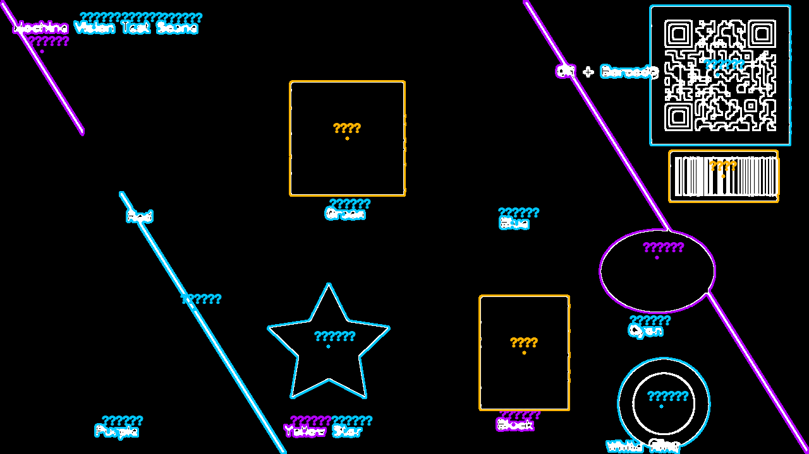</td>
  </tr>
  <tr>
    <td align="center"><b>Color Detection (Red)</b><br/>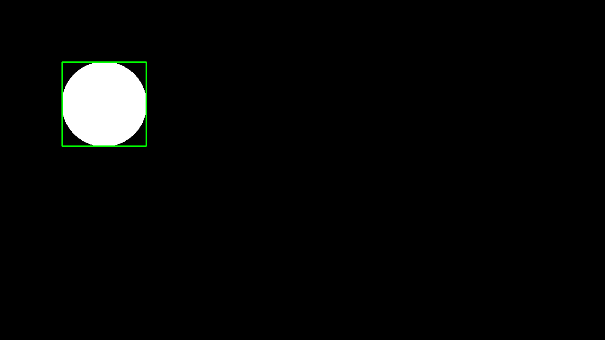</td>
    <td align="center"><b>QR / Barcode</b><br/>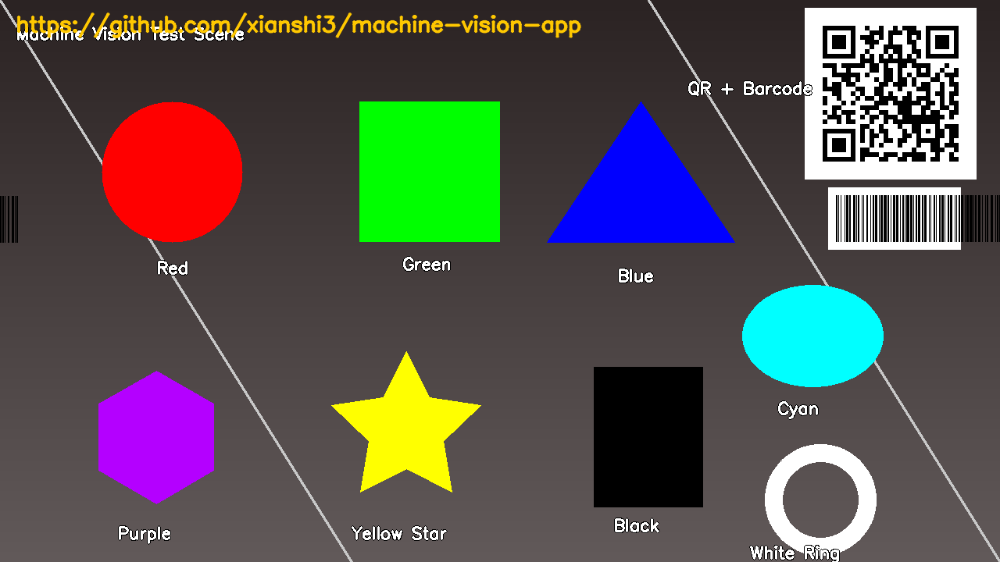</td>
  </tr>
  <tr>
    <td align="center"><b>Template Matching</b><br/>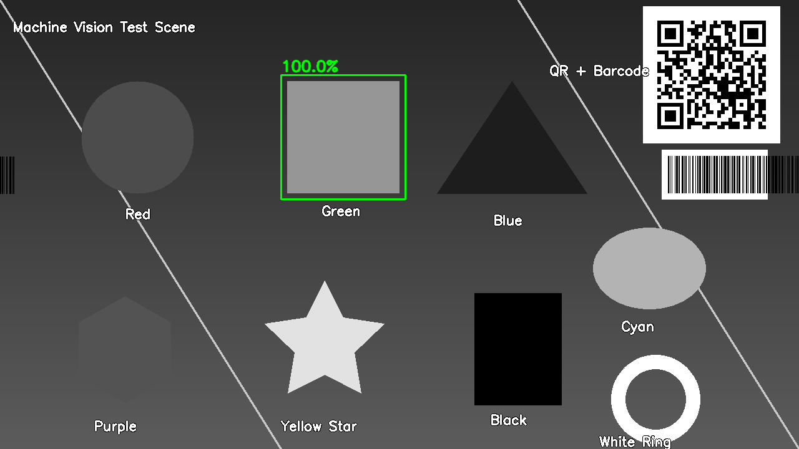</td>
    <td align="center"><b>Feature Matching (ORB)</b><br/>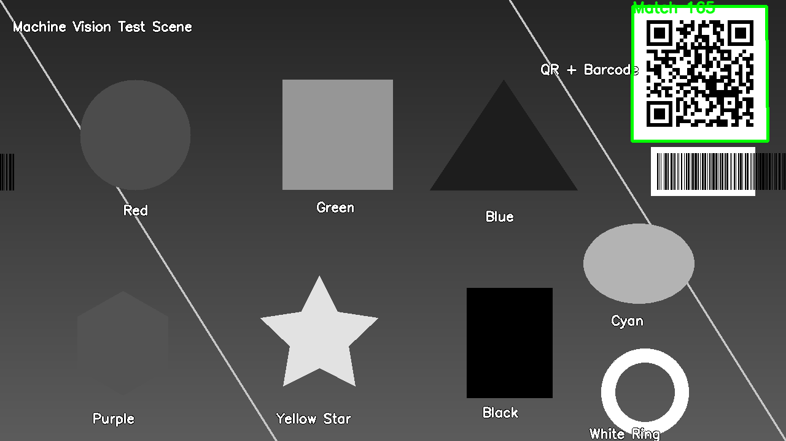</td>
  </tr>
  <tr>
    <td align="center"><b>Enhancement (CLAHE + Sharpen)</b><br/>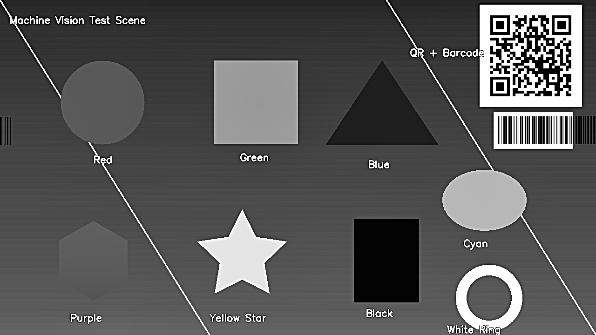</td>
    <td align="center"><b>Face Detection</b><br/>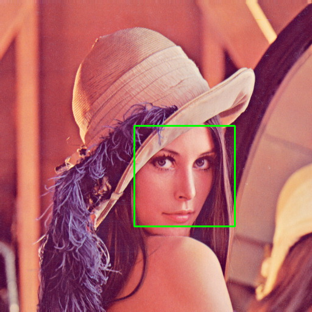</td>
  </tr>
</table>

---

## How It Works

1. **Select Source** – Choose "Local Camera" or "Network Stream"
2. **Configure** – For network, enter the IP address and port
3. **Connect** – Establish the video stream connection
4. **Choose Mode** – Pick one of 11 processing algorithms
5. **Process** – Real-time processing and face detection, with FPS and timing stats
6. **Adjust** – Fine-tune Canny thresholds and re-apply (Canny / Contour modes)
7. **Scan / Detect / Match** – Point the camera at a QR code, colored object, shape, or a loaded template
8. **Save** – Take screenshots or record video at any time
9. **Load Image** – Offline analysis from image files

All processing runs asynchronously on a background thread, keeping the UI responsive.

---

## Using Your Phone as Camera

1. Install **IP Webcam** (Android) or a similar app on your phone
2. Make sure the phone and PC are on the same Wi-Fi network
3. Launch the app and note the URL (e.g., `http://192.168.1.100:8080/video`)
4. In this application:
   - Select **"Network Stream"** as the source
   - Enter the IP and port
   - Click **Connect**

The app automatically constructs the MJPEG URL and starts streaming.

---

## Project Structure

```
MachineVisionApp/
├── App.xaml / App.xaml.cs          # Application entry and default culture (en-US)
├── MainWindow.xaml / .cs           # Main UI and event orchestration
├── TranslationService.cs           # i18n singleton with INotifyPropertyChanged
├── AppLogger.cs                    # Logging service (singleton)
├── Resources/
│   ├── Strings.resx                # Chinese resource strings (fallback)
│   └── Strings.en.resx             # English resource strings
├── Components/
│   ├── VideoCaptureComponent.cs    # Camera source (local + network)
│   ├── ImageDisplayComponent.cs    # WPF Image display and frame update
│   ├── ImageProcessingComponent.cs # 5 classic modes (Canny/Sobel/Laplacian/Binary/Contour)
│   ├── FaceDetectionComponent.cs   # Haar cascade face detection
│   ├── BarcodeDetectionComponent.cs # QR/barcode decoding (ZXing.Net)
│   ├── ColorDetectionComponent.cs  # HSV color detection + click-to-pick sampling
│   ├── TemplateMatchComponent.cs   # Template matching with score
│   ├── ShapeDetectionComponent.cs  # Geometric shape classification + statistics
│   ├── FeatureMatchComponent.cs    # ORB feature matching + RANSAC homography
│   ├── EnhancementComponent.cs     # CLAHE + unsharp masking enhancement
│   ├── RecordingComponent.cs       # AVI video recording via VideoWriter
│   └── ThresholdParameterComponent # Canny threshold UI logic
├── Views/
│   ├── CustomTitleBar.xaml / .cs   # Custom window chrome + language switch
├── TestImages/                     # Sample test images (scene, templates, face photo)
├── docs/images/                    # Screenshots used by this README
└── haarcascade_frontalface_default.xml
```

### Key Architecture

| Component | Responsibility |
|-----------|----------------|
| `VideoCaptureComponent` | `VideoSourceType.LocalCamera` / `.NetworkStream`, auto-fallback APIs (DSHOW → MSMF → ANY), connection state machine |
| `ImageDisplayComponent` | Batched `Dispatcher.Invoke` for dual-image update |
| `ImageProcessingComponent` | 5 classic modes: Canny, Sobel, Laplacian, Binary Threshold, Contour Detection |
| `FaceDetectionComponent` | `DetectMultiScale` + histogram equalization preprocessing + bounding box rendering |
| `BarcodeDetectionComponent` | ZXing.Net decoding of QR/DataMatrix/EAN/UPC/Code128/Code39, frame-throttled with result caching |
| `ColorDetectionComponent` | HSV `InRange` masks + morphology + contour counting for 9 preset colors, plus click-to-pick custom sampling |
| `TemplateMatchComponent` | `MatchTemplate` (CCoeffNormed) with threshold gating and score overlay |
| `ShapeDetectionComponent` | Canny + contour polygon approximation + circularity analysis, classifies circles/rects/triangles/pentagons/polygons |
| `FeatureMatchComponent` | ORB keypoints + BFMatcher ratio test + RANSAC homography, draws perspective detection box |
| `EnhancementComponent` | CLAHE histogram equalization + unsharp masking |
| `RecordingComponent` | `VideoWriter`-based AVI recording with MJPG codec |
| `ThresholdParameterComponent` | Validates input and fires `OnThresholdsChanged` |
| `TranslationService` | `INotifyPropertyChanged` singleton, `ResourceManager`-backed, fires full refresh on culture switch |
| `AppLogger` | `ObservableCollection<LogEntry>` singleton with INFO/WARN/ERROR levels |

---

## Internationalization

- Default language is **English** (click **EN/中** in the title bar to switch to Chinese)
- All UI strings are managed via `.resx` resource files
- To add a new language: copy `Strings.en.resx`, rename to `Strings.xx.resx`, and translate the values

---

## Requirements

- .NET 8 SDK (build only; the release package below is self-contained)
- Windows 10/11 with WPF support
- NuGet packages (restored automatically):
  - `OpenCvSharp4` – OpenCV bindings
  - `OpenCvSharp4.runtime.win` – Native OpenCV binaries
  - `OpenCvSharp4.WpfExtensions` – `BitmapSource` conversion
  - `ZXing.Net` – QR code and barcode decoding

---

## Getting Started

### Download (no build required)

Grab the latest self-contained package from [Releases](../../releases/latest):

1. Download `MachineVisionApp-win-x64-vX.Y.Z.zip`
2. Extract it to any folder
3. Run `MachineVisionApp.exe`

### Build from source

```bash
# Clone the repository
git clone https://github.com/xianshi3/machine-vision-app.git
cd machine-vision-app

# Restore and build
dotnet restore
dotnet build -c Release

# Run
dotnet run --project MachineVisionApp/MachineVisionApp.csproj
```

Or open `MachineVisionApp.sln` in Visual Studio 2022 and press **F5**.

### Try the bundled test images

Open `TestImages/` from the Load Image dialog:

| Image | What to test |
|-------|--------------|
| `test_scene.png` | All processing modes – edges, contours, shapes, colors, QR/barcode (`https://github.com/xianshi3/machine-vision-app`) |
| `template_green.png` | Template Matching (green square, score ≈ 1.0) |
| `template_qr.png` | Feature Matching (texture-rich QR crop) |
| `face_lena.jpg` | Face Detection |

---

## Tech Stack

| Technology      | Description                     |
|-----------------|---------------------------------|
| `WPF`           | UI framework for Windows apps   |
| `OpenCvSharp`   | .NET wrapper for OpenCV 4.x     |
| `ZXing.Net`     | QR code and barcode decoding    |
| `C#`            | Primary programming language    |
| `XAML`          | UI design and layout            |
| `.resx`         | Resource files for i18n         |

---

## License

This project is for learning and demonstration purposes.
